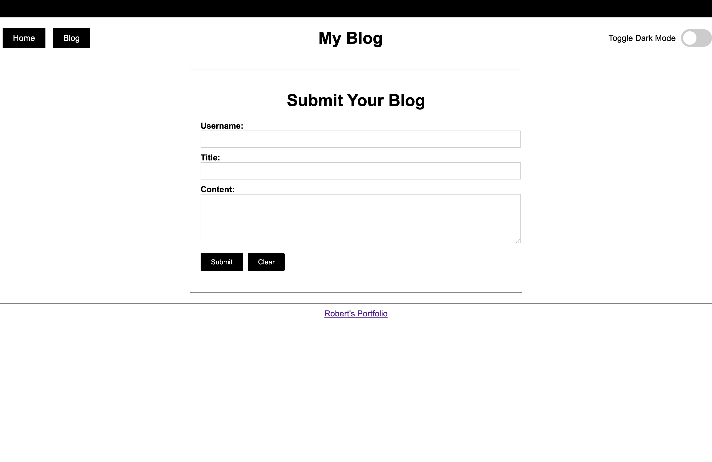
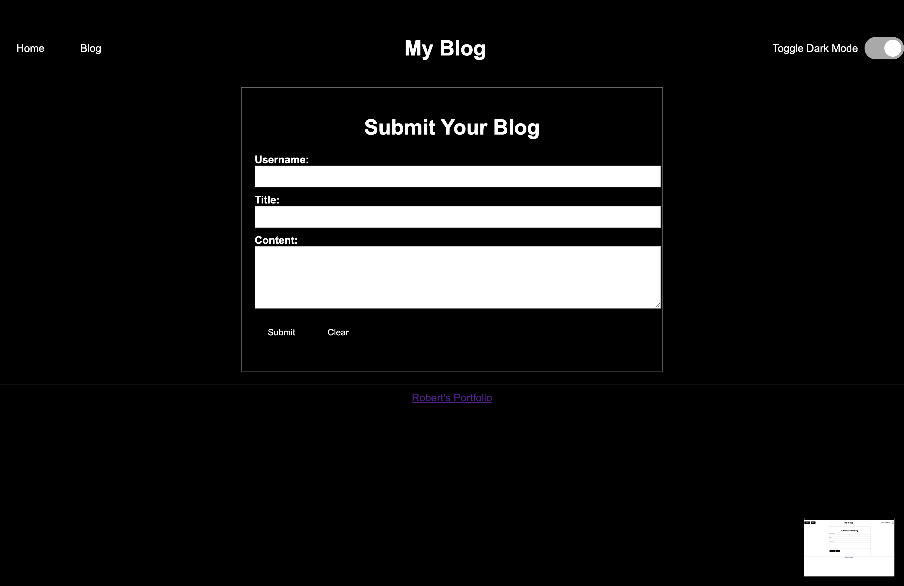
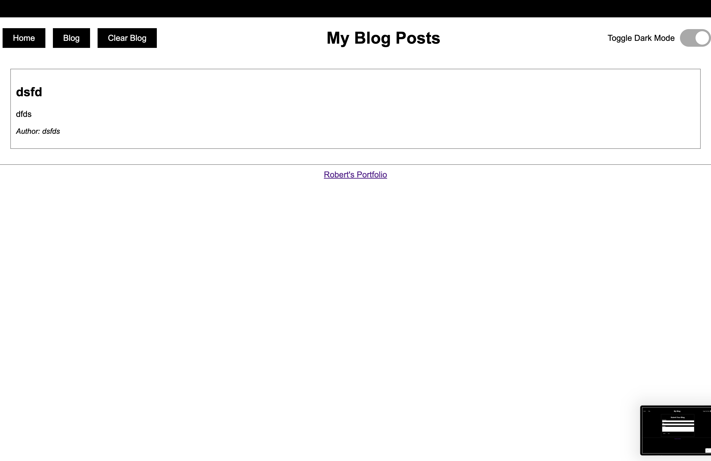
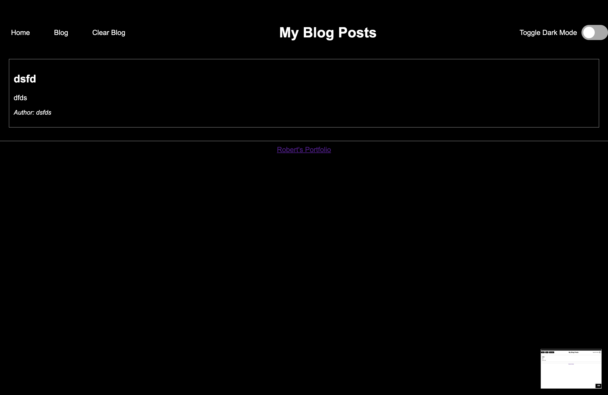

# My Blog App

## Link To Deployed App

<https://rp192w.github.io/personal-blog>

## Overview

This repository contains the code for a simple blog application that allows users to submit blog posts and view existing ones. It includes a form for blog submission, a dynamic list of blog posts, and a toggle for dark mode. The application uses `localStorage` to persist blog posts and includes basic frontend JavaScript for interaction.

## File Structure

### HTML Files

- `index.html`: The main page with a form to submit blog posts.
- `blog.html`: Displays existing blog posts and has an option to clear all posts.

### CSS Files

- `styles.css`: General styles used across the application.
- `form.css`: Specific styles for the blog submission form.
- `blog.css`: Styles for the blog posts page.

### JavaScript Files

- `form.js`: Contains JavaScript code to handle blog post submission and form interactions.
- `blog.js`: Manages the display of blog posts and the "Clear Blog" functionality.
- `logic.js`: Contains shared logic such as dark mode toggling.

## Setup and Running

To run the application, you can open `index.html` or `blog.html` in a web browser. If using a local development environment, ensure your web server supports `localStorage`, which is required to persist blog posts.

### Home Page (`index.html`)

This page includes:

- A form to submit a new blog post.
- Fields for the username, blog title, and content.
- A "Clear" button to reset the form.
- A "Submit" button to add the blog post.
- A toggle for dark mode.

### Blog Posts Page (`blog.html`)

This page displays existing blog posts and allows users to:

- View existing blog posts.
- Clear all blog posts by clicking the "Clear Blog" button.
- Toggle between light and dark modes.

## Known Issues

- The "Clear Blog" button might not work if `localStorage` is disabled or if there are script errors. If it doesn't work, check for errors in the browser console.
- Ensure `localStorage` is enabled in your browser to retain blog posts.

## Screenshots

These images shows index.html and blog.html in their light and dark states

 | 
:---: | :---:
 | 
